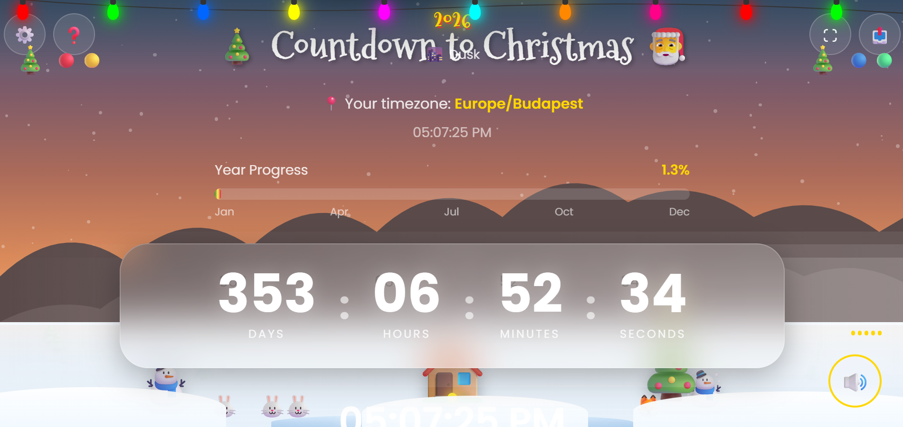

**WARNING**: This is still a work in progress and clearly not yet finished. If you are a web designer and the layout of this website cringes you... im sorry, I'm still trying to fix some stuff.

# 🎄 Holiday Countdown Timer 🎆

A beautiful, interactive countdown timer for Christmas and New Year with stunning animations and a dynamic landscape that changes based on your local time.



## ✨ Features

### 🎯 Core Features
- **Dual Countdown** - Switch between Christmas and New Year countdowns
- **Precise Timer** - Days, Hours, Minutes, Seconds, and Milliseconds
- **Auto Timezone Detection** - Automatically detects your local timezone
- **Real-time Clock** - Shows your current local time and date

### 🌄 Dynamic Landscape
- **Time-based Sky** - Sky color changes based on time of day (dawn, day, dusk, night)
- **Animated Sun & Moon** - Celestial bodies move across the sky realistically
- **Northern Lights** - Beautiful aurora effect visible at night
- **Parallax Mountains** - Multi-layered mountain scenery with depth effect
- **Snowy Ground** - Complete winter landscape with cabin, trees, and frozen lake

### 🎬 Animations
- **Snowfall** - Realistic falling snowflakes
- **Flying Birds** - Birds occasionally fly across the sky
- **Santa's Sleigh** - Santa flies across the sky from Dec 25 to Jan 2! 🎅
- **Shooting Stars** - Visible during nighttime
- **Floating Clouds** - Gentle cloud movement
- **Ground Animals** - Rabbits, deer, and foxes in the landscape

### 🎮 Interactive Elements
- **Advent Calendar** - Open a door each day in December
- **Wish List** - Add up to 10 personal holiday wishes
- **Fun Facts** - Rotating holiday trivia
- **Click Effects** - Festive emoji bursts on click
- **Confetti** - Click the year for confetti explosion!

### 🎵 Audio
- **Ambient Music** - Separate tracks for Christmas and New Year
- **Sound Effects** - UI interaction sounds
- **Volume Control** - Adjustable volume slider

### ⚙️ Customization
- Toggle snow, lights, aurora, fog, and animals
- Show/hide milliseconds and statistics
- Reduce motion option for accessibility
- High contrast mode

### 📱 Responsive Design
- Works on desktop, tablet, and mobile
- Landscape and portrait orientations
- Touch-friendly controls

## ⌨️ Keyboard Shortcuts

| Key | Action |
|-----|--------|
| `M` | Toggle music |
| `S` | Open settings |
| `F` | Toggle fullscreen |
| `C` | Switch to Christmas |
| `N` | Switch to New Year |
| `?` | Show help/shortcuts |
| `Space` | Confetti burst |
| `Esc` | Close modals |

## 🚀 Live Demo

👉 **[View Live Demo](https://arlit1-f.github.io/holiday-countdown/)**

## 📁 Project Structure
```text
├── index.html # Main HTML file
├── style.css # All styles
├── script.js # JavaScript functionality
├── README.md # This file
└── assets/
├── audio/
│ ├── christmas-ambient.mp3
│ └── newyear-ambient.mp3
└── images/
└── preview.png
```

## 🛠️ Installation

### Option 1: Direct Download
1. Download or clone this repository
2. Open `index.html` in your browser
3. Enjoy!

### Option 2: Clone with Git
```bash
git clone https://github.com/yourusername/holiday-countdown.git
cd holiday-countdown
# Open index.html in your browser
```

## 🎵 Adding Custom Music

1. Create the `assets/audio/` folder
2. Add your MP3 files:
    - christmas-ambient.mp3
    - newyear-ambient.mp3
3. Refresh the page

### Free Music Sources

- [Pixabay](https://pixabay.com) Music - No attribution required
- [Mixkit](https://mixkit.co) - Free stock music
- [Uppbeat](https://uppbeat.io) - Free with attribution 


## 📄 License
This project is open source and available under the [MIT License](https://github.com/ArliT1-F/holidays-countdown/blob/main/LICENSE).

## 🤝 Contributing
Contributions are welcome! Feel free to:

1. Fork the repository
2. Create a feature branch (`git checkout -b feature/feature`)
3. Commit your changes (`git commit -m 'Add a cool feature'`)
4. Push to the branch (`git push origin feature/feature`)
5. Open a Pull Request
